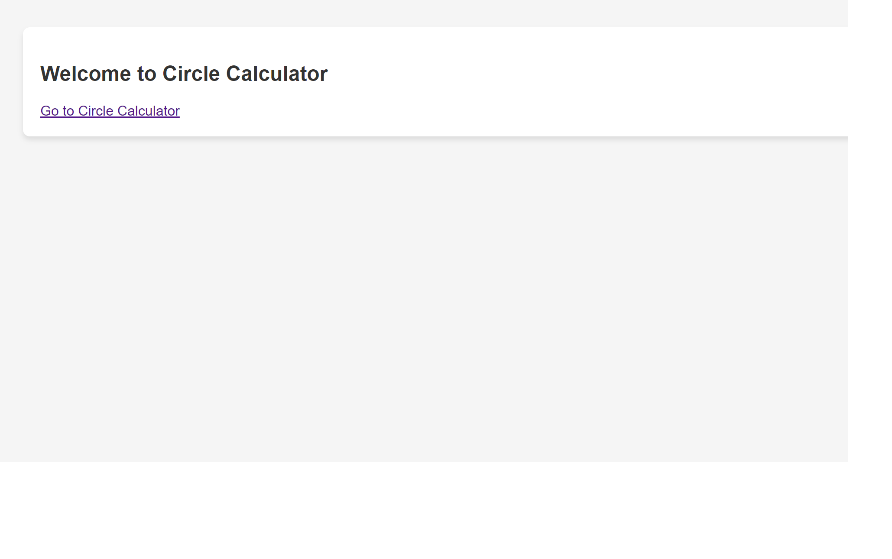
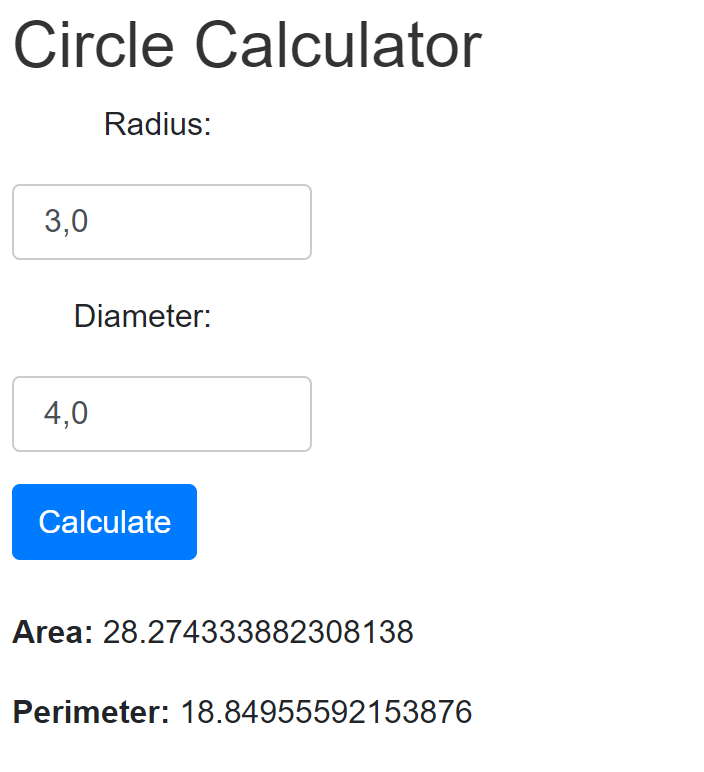

# Circle Calculator

## Introduction
`Circle Calculator` is an application developed to provide calculations related to circles. This application showcases basic functionalities including computing area, circumference, and other circle-related properties.

## Screenshots

### Table of Contents

### Main Page

## Key Features
- Compute circle area
- Calculate circle circumference

## Technologies Used
This project was developed using:
- Java
- Spring Boot

## Conclusion
The `Circle Calculator` provided an opportunity to further understand Java and Spring development. Your attention is greatly appreciated. Please don't hesitate to reach out with any questions or feedback.
